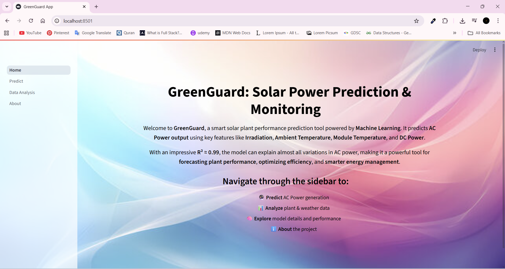
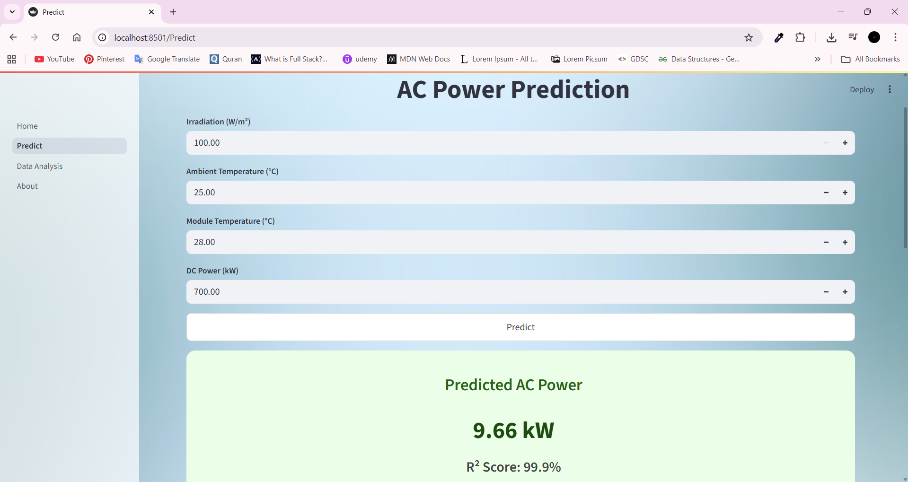
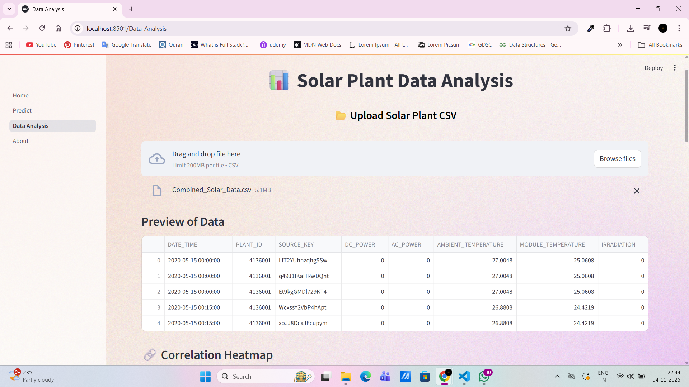

# ☀️ GreenGuard: Solar Power Prediction & Monitoring

**GreenGuard** is an ML-powered app that predicts **AC Power output** of solar plants using key parameters like  
☀️ Irradiation, 🌡️ Ambient & Module Temperature, and ⚡ DC Power.

---

## 🚀 Tech Stack
- 🐍 Python, Pandas, NumPy  
- 🤖 Scikit-learn (Random Forest Regressor)  
- 🌐 FastAPI  
- 🎨 Streamlit  

---

## 📊 Model Performance
| Metric | Score |
|---------|--------|
| MAE | 0.12 |
| RMSE | 0.65 |
| R² | 0.99 |

---

## 🖼️ Screenshots
*(Add inside `assets/` folder)*  
  




---

## ⚙️ Run Locally
```bash
git clone https://github.com/ARSHIYA31/Green-Guard.git
cd Mini_Project
pip install -r requirements.txt
streamlit run app.py
